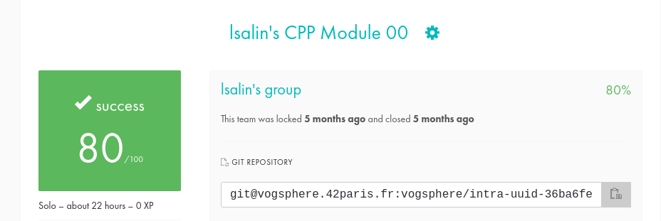
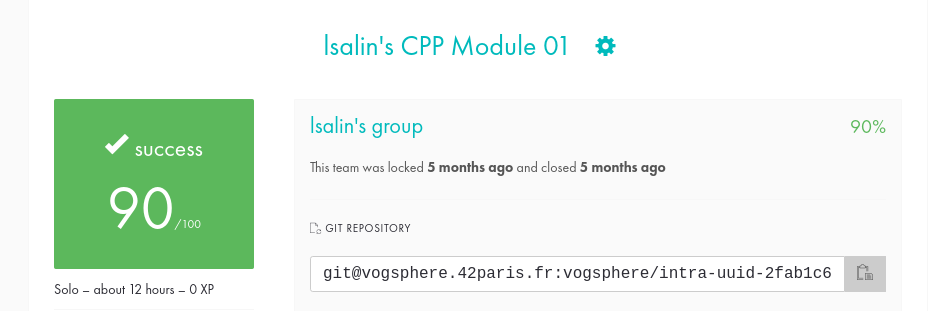
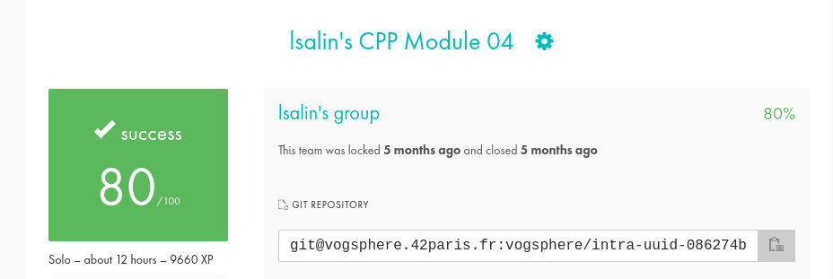
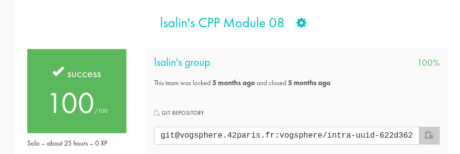
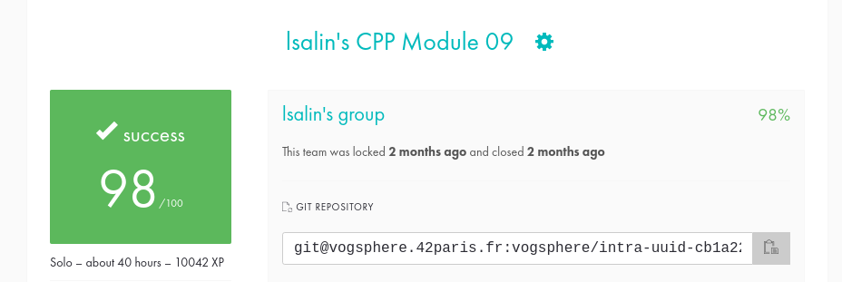

# CPP_Modules

🇺🇸

These ten modules introduce object-oriented programming and more particularly the C++ language!  
Each module contains a list of exercises, ranging from the easiest to the most difficult.

Programs must compile with `c++` and flags `-Wall` `-Wextra` `-Werror` `-std=c++98`.

__Concepts covered during these modules__:

* Module00 : basic notions like namespaces, classes, member functions, stdio streams, initialization lists, static and constant variables.
* Module01 : memory allocation, pointers to members, references and switch.
* Module02 : ad-hoc polymorphism, operator overloading, Coplian canonical form and representation of fixed-point numbers.
* Module03 : inheritance.
* Module04 : polymorphism by subtyping, abstract classes, interfaces and notion of deep copy.
* Module05 : exceptions.
* Module06 : casting, scalar conversions and serialization.
* Module07 : templates.
* Module08 : container templates, iterators and algorithms.
* Module09 : STL (vector, list and map).

🇫🇷

Ces dix modules introduisent à la programmation orientée objet et plus particulièrement le langage C++ !  
Chaque module contient une liste d'exercices, allant du plus facile au plus difficile.

Les programmes doivent compiler avec `c++` ainsi que les flags `-Wall` `-Wextra` `-Werror` `-std=c++98`.

__Notions abordées durant ces modules__ :

* Module00 : notions de base comme les namespaces, les classes, les fonctions membres, les streams stdio, les listes d’initialisation, les variables statiques et constantes.
* Module01 : allocation mémoire, pointeurs sur membres, références et switch.
* Module02 : polymorphisme ad-hoc, surcharge d’opérateurs, forme canonique de Coplien et représentation des nombres en virgule fixe.
* Module03 : héritage.
* Module04 : polymorphisme par sous-typage, classes abstraites, interfaces et notion de copie profonde.
* Module05 : exceptions.
* Module06 : casting, conversions scalaire et sérialisation.
* Module07 : templates.
* Module08 : containers templates, itérateurs et algorithmes.
* Module09 : STL (vector, list et map).

